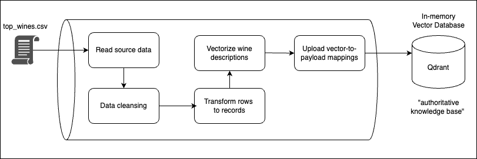

# Wine RAG
A wine rating data set used for Retrieval Augmented Generation (RAG) on a local LLM.

## What is Retrieval-Augmented Generation?

Retrieval-Augmented Generation (RAG) is the process of optimizing the output of a large language model, so it references an authoritative knowledge base outside of its training data sources before generating a response. Large Language Models (LLMs) are trained on vast volumes of data and use billions of parameters to generate original output for tasks like answering questions, translating languages, and completing sentences. RAG extends the already powerful capabilities of LLMs to specific domains or an organization's internal knowledge base, all without the need to retrain the model. It is a cost-effective approach to improving LLM output so it remains relevant, accurate, and useful in various contexts.

## Description

This project showcases how an external data source can be incorporated in the generation process of a pre-trained, foundation model.   Thus, in this case, the authoritative knowlege base is constructed from a data set of wine ratings, by implementing the following ETL data pipeline:



Once the vector database has been constructed, it is ready to assist in the response generation of a (locally running) LLM:


This project is an adaptation to _[Alfredo Desa's RAG tutorial](https://github.com/alfredodeza/learn-retrieval-augmented-generation)_, primarily to:

1. expand the background description to provide more context;
2. enumerate steps required to setup an LLM locally;
3. define a single jupyter notebook with all the code showcasing the RAG process. 

## Third-Party Technologies

Following are the different third-party technologies used by this project:

### Vector Database

We use _[Qdrant](https://github.com/qdrant/qdrant#readme)_ as both, a vector similarity search engine and a vector database to store a vectorized version of the wines notes, along with the associated wine data (payload).

### Large Language Model

In order to use a self-contained, locally deployed LLM, we make use of a _[Llamafile](https://github.com/Mozilla-Ocho/llamafile#readme)_.  More specifically, we use the _**mxbai-embed-large-v1**_ LLM (0.7 GB) which you can [download from here](https://huggingface.co/Mozilla/mxbai-embed-large-v1-llamafile/resolve/main/mxbai-embed-large-v1-f16.llamafile?download=true).

### Open AI's Python API

To programmatically connect to the locally running LLM, we use _[Open AI's Python API](https://pypi.org/project/openai/)_

## Environment Setup

Create a Python virtual environment and install required dependencies:

```
python3 -m venv .venv
source ./.venv/bin/activate
make install
```
